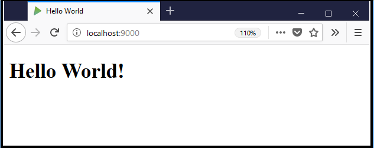
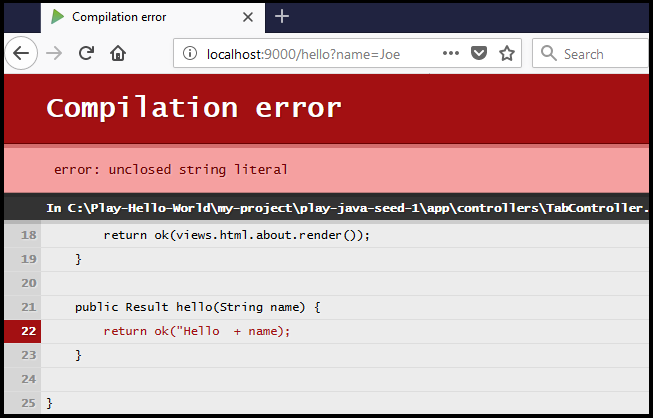
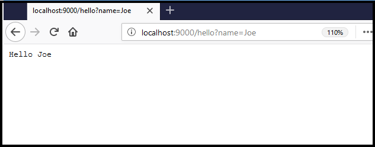
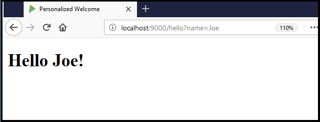

# Create a Play "Hello World" application using Java

This tutorial shows you how to create a Play project from a [giter8](http://www.foundweekends.org/giter8/) template. It describes how to make simple changes to the project to give you a feel for working with Play. In a just a few minutes, you will learn about:

* The structure of a Play project
* Play's hot reload capability
* How to use an HTTP request parameter to pass a value

In contrast with web frameworks that were designed to support large eco-systems, such as Java EE, Play was developed by web developers&mdash;for web development. Play saves precious development time by directly supporting common tasks and hot reloading so that you can immediately view the results of your work. As a full-stack framework, it includes all of the components you need to build a web application such as an integrated HTTP server, form validation, Cross-Site Request Forgery (CSRF) protection, RESTful web services API, and more.

Play offers both Java and Scala APIs. As a Java developer, you will find Play's Model-View-Controller (MVC) architecture familiar and easy to learn. The large Java community using Play offers an excellent resource for getting questions answered.

The Play Framework uses Scala and Akka under the hood. This endows Play applications with a stateless, non-blocking, event-driven architecture that provides horizontal and vertical scalability and uses resources more efficiently.  

## Prerequisites

To follow the steps in this tutorial, you will need the correct version of Java and a build tool. You can build Play projects with sbt or Gradle. Since sbt works particularly well with Play, we recommend trying this example with sbt. The template requires:

* Java Software Developer's Kit (SE) 1.8 or higher
* sbt 0.13.13 or higher

To check your Java version, enter the following in a command window:

```bash
java -version
```

To check your sbt version, enter the following in a command window:

```bash
sbt sbt-version
```

If you do not have the required versions, follow these links to obtain them:

* [Java SE](http://www.oracle.com/technetwork/java/javase/downloads/index.html)
* [sbt](http://www.scala-sbt.org/download.html)

## Create and run the project

A Play project created from a seed template includes all Play components and an HTTP server. Play uses Akka HTTP by default, but you can configure it to use [Netty](https://netty.io/). The project is also configured with filters for Cross-Site Request Forgery (CSRF) protection and security headers.

Use the template to create and run a project:

1. In a command window, enter: `sbt new playframework/play-java-seed.g8`

    The template prompts you for a project name, an organization name, and the versions to use for Scala, Play, and sbt.

1. Press `Enter` at each prompt to accept the default value.

    The template downloads Play components and set up the project structure.

1. Change into the new project directory, for example: `cd play-java-seed`

1. Build the project. Enter: `sbt run`

    The project builds and starts the embedded HTTP server. Since this downloads libraries and dependencies, the amount of time required depends partly on your connection's speed.

1. After the message `Server started, ...` displays, enter the following URL in a browser:

    <http://localhost:9000>

    The Play application responds `Welcome to Play!`.

## Explore the project

If you browse the project, you will find application components under the `app` subdirectory. Within that subdirectory, you will find a familiar organization of controllers and views. Since this simple project does not use data, it does not contain a `model` directory, but this is where you would add it. You'll find the location for images, javascript, and stylesheets in the `public` subdirectory. For more details, see [The Play application layout](https://www.playframework.com/documentation/2.6.x/Anatomy#The-Play-application-layout).

> Change to a local cross-reference to the doc when this tutorial is included in the doc. [[the Play application layout|Anatomy]]

To construct the simple welcome message, the project uses:

* A controller that defines an `index` action method.
* A `routes` file that maps a request to the `localhost` root URL to the `index` action.
* A Twirl template that the `index` action calls to generate HTML page contents. The [Twirl](https://www.playframework.com/documentation/2.6.x/JavaTemplates) template language is:
    * Easy to learn
    * Requires no special editor
    * Provides type safety
    * Is compiled so that errors display in the browser

>Change link above to local doc link

Note: in the remaining content, for Windows shells, substitute `/` for `\` in path names.

Let's take a look at the implementation:

1. Navigate to the `app/controllers` project directory and open `HomeController.java` with your favorite editor. The controller class includes the `index` action method that tells the web server to return the contents of the `index.html` file in response to a request:

    ```java
    public Result index() {
        return ok(views.html.index.render());
    }
    ```

1. Navigate to the project `conf` directory and open the `routes` file. A route consists of an HTTP method, a path, and an action method. This control over the URL schema makes it easy to design clean, human-readable, bookmarkable URLs. The following line maps a GET request for the root URL `/` to the `index` action in `HomeController.java`:

    ```routes    GET     /           controllers.HomeController.index
    ```

1. Navigate to the project `app/views` directory and open `index.scala.html` with a text editor. The `@main` directive in this file calls the main template `main.scala.html` to generate the page.

1. Open `main.scala.html` to see how text parameter sets the page title, and the HTML markup supplies the welcome message.

## Modify the welcome message

Now that you see where the welcome message comes from, it's a simple text change to create a "Hello World" message:

1. In `index.scala.html`, change `Welcome to Play` to `Hello World` in both the title parameter and in the `<h1>` element.

1. Save the file.

1. Refresh the browser. This showcases Play's hot-reload capability. It automatically picks up the change and recompiles when necessary, avoiding the long build-redeploy cycle of many Java web and application server frameworks.

  

## Add a page

Let's add a second page to this project. If this were a real application, we would likely create subdirectories for the main pages of the site and put the links to them in a header and/or sidebar. But, to keep things simple, we will just add an `About` page in the `views` directory and add a link to the new page on the `index` page.

1. Add an action method for the new page by modifying `HomeController.java`:
    1. Copy the `index` method.
    1. Change the name of the copied method from `index` to `about`.
    1. Change the parameter in the return value of the `about` action method from `views.html.index.render` to `views.html.about.render`.
    1. Save `HomeController.java`.
1. Define the route for the new file:
    1. Open the `conf/routes` file.
    1. Add the following line below the index route:
   `GET     /about                      controllers.HomeController.about`
    Play will use this to respond to a URL of `localhost:9000/about`
    1. Save the `routes` file.
1. Create the HTML page template:
    1. Copy the file `app/views/index.scala.html` to `about.scala.html`.
    1. Change the text `Hello World` in the title parameter and the `<h1>` element to `About Play`.
    1. Save the file.
1. Add a link from the home page to the new about page:
    1. Open `/views/index.scala.`
    1. Under the `<h1>` element, insert the following:
    `<h2><a href="@routes.HomeController.about()">About</a></h2>`
    1. Save the file.
1. Refresh your browser and the index page should contain a link to the new `About` page.
1. Click the link to open the new page.

## Use an HTTP request parameter

As the final part of this tutorial, modify the `About` page to accept an HTTP request parameter. First, create an action that accepts a name from the request and outputs it. We will introduce an error to demonstrate how Play provides useful feedback.  Then, bind an HTTP query parameter to the action parameter. Finally, create a page template so that you can style the results:

1. In the `HomeController.java` file, add a new `hello` action method using the following code. In the return parameter, be sure to leave out the end quote in the `"Hello` string to cause an error:

    ```java
    public Result hello(String name) {
        return ok("Hello  + name);
    }
    ```

1. In the `routes` file, create a new line that maps a `hello` request to the `hello` action and declares the `name` parameter:

    ```routes
    GET    /hello             controllers.HomeController.hello(name: String)
    ```

1. In the browser, enter the following URL and pass in any name as a query parameter to the `hello` method:

    <http://localhost:9000/hello?name=MyName>

1. Play responds with a helpful compilation error:

    

1. In the `HomeController.java` file, add the missing closing quote for "Hello" in the return statement: `return ok ("Hello " + name);`.

1. Refresh the browser, and you should see something like this:

    

  The text is unformatted because the HTTP server is returning this value directly from the request. Next, let's add a template for the page:

1. In the `views` directory, copy the `about.scala.html` file to a file named `hello.scala.html`.

1. In the `hello.scala.html` file:
    1. On the first line, add the name parameter and its type to the @ directive:
    `@(name: String)`
    1. Change the title to `Personalized Welcome`:
    `@main("Personalized Welcome")`
    1. Change the text in the heading from `About Play` to:
    `<h1>Hello @name!</h1>`

1. In the `HomeController.java` file, change the return value of the `hello` action to call the template instead of returning the request string directly:

    ```java
    public Result hello(String name) {
        return ok(views.html.hello.render(name));
    }
    ```

1. Refresh the browser and the greeting displays from the HTML page:

    

We hope you've had fun learning about and working with Play. To learn more, try one of our example projects. <link to page listing examples>
